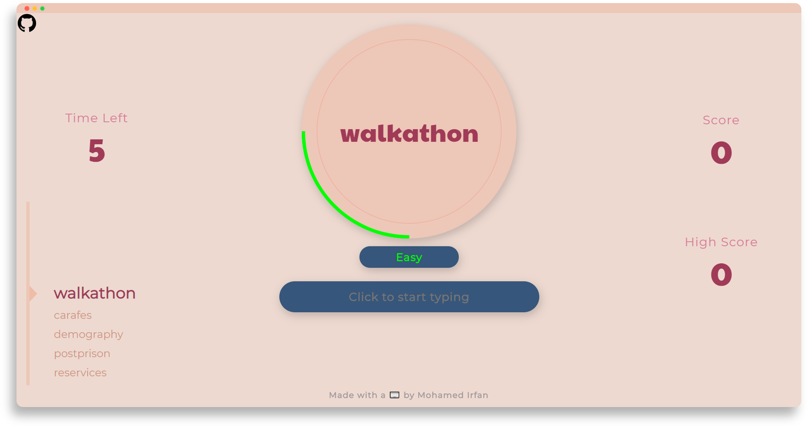
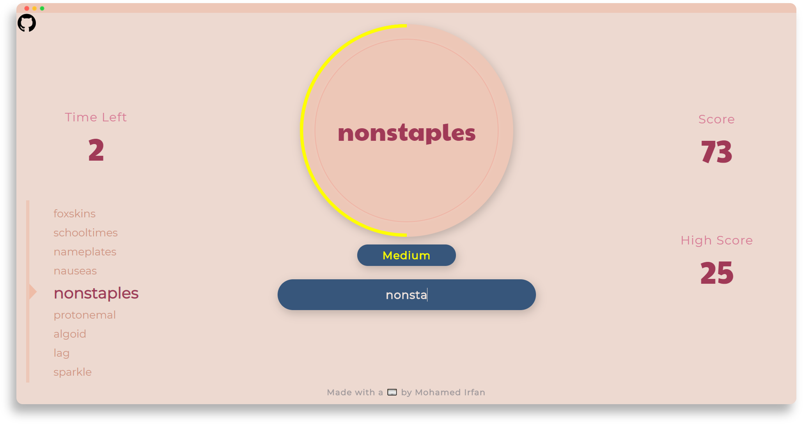
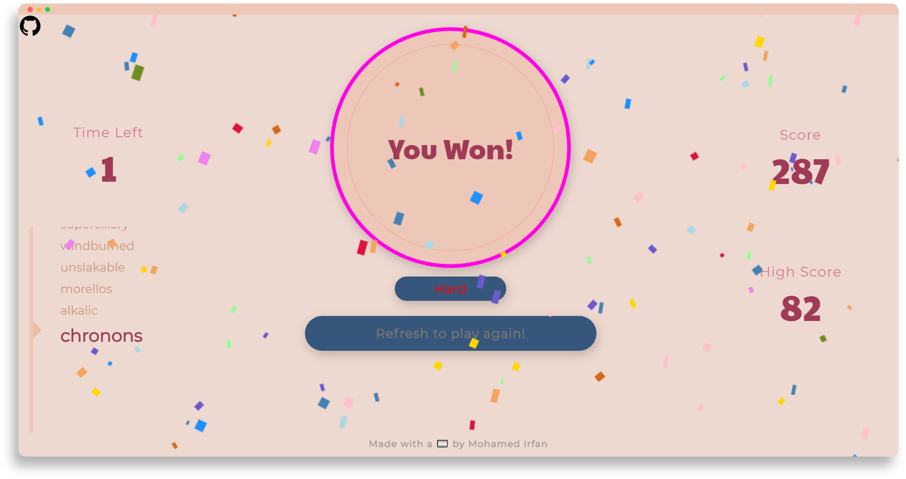

# Hyper Typer

A challenging speed typing game to put your typing skills to the test. Written purely in vanilla JavaScript, Hyper Typer is a fun but very challenging browser game. Give it a try [here](https://mohamedirfansh.github.io/Hyper-Typer/) to see if you can complete the game!

## 📖 Overview

#### Start by typing the word found inside the circle


#### Type as fast as you can to advance through the levels


#### Complete the game and get an unbeatable high score


### 🔎 How it works

The game pulls random words from an external API called [Random-Word-API](https://random-word-api.herokuapp.com/home) when the game starts. The player has to type these words correctly within the time limit. If the time is up and the word was not typed, the game ends. But if the word was correctly typed, the game continues to advance. After a certain number of words, the game increases its difficulty from easy to medium then hard. The game is completed when you type all the words in the hard level correctly.

## 🚀 Getting Started

### 📋 Prerequisites 

If you just want to play the game, you can play it [here](https://mohamedirfansh.github.io/Hyper-Typer/). The only prerequisite is:

+ A web browser newer than IE 9/ Firefox 4

### ⚡️ Installing and running

Run the following command in your terminal:
```
git clone https://github.com/mohamedirfansh/Hyper-Typer.git
```
Then, open ```index.html```.

## 🛠️ Built With

+ [JavaScript](https://developer.mozilla.org/en-US/docs/Web/JavaScript) - The main language used to develop the game
+ HTML5 & CSS3 - To structure and style the webpage
+ [Random-Word-API](https://random-word-api.herokuapp.com/home) - The external API used to receive random words for the player to type
+ [Confetti.js](https://github.com/mathusummut/confetti.js) - Used to generate the confetti seen in the game

## 📄 License

[](https://github.com/mohamedirfansh/Hyper-Typer/blob/master/LICENSE)

This project is licensed under the **[MIT License](http://opensource.org/licenses/mit-license.php)** - see the [LICENSE](https://github.com/mohamedirfansh/Hyper-Typer/blob/master/LICENSE) file for more details.